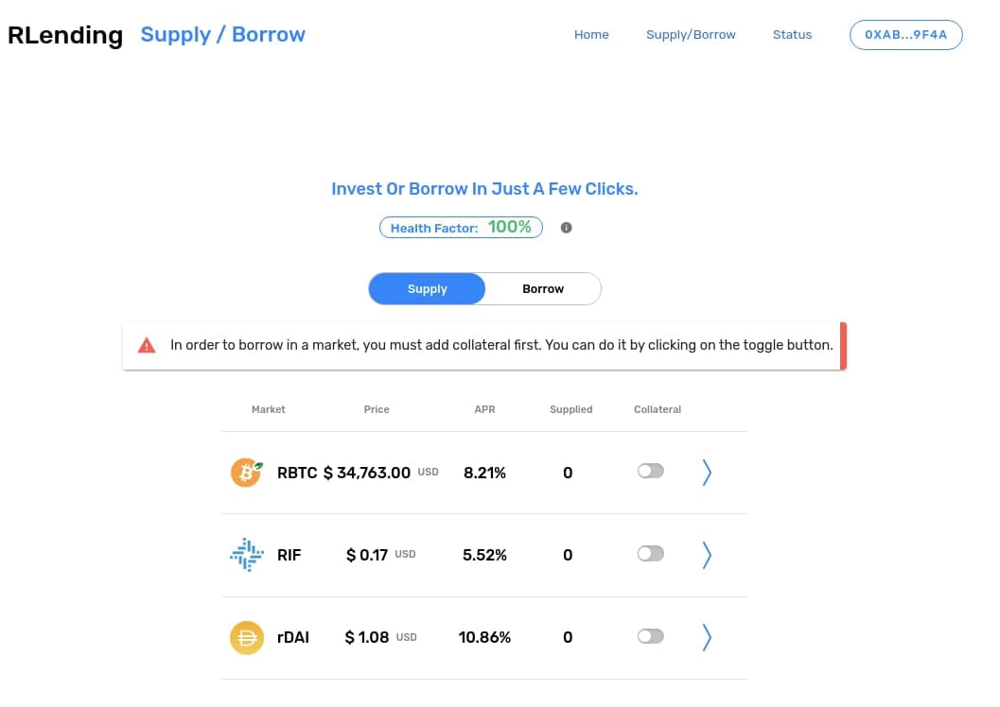
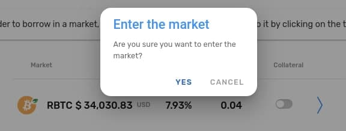
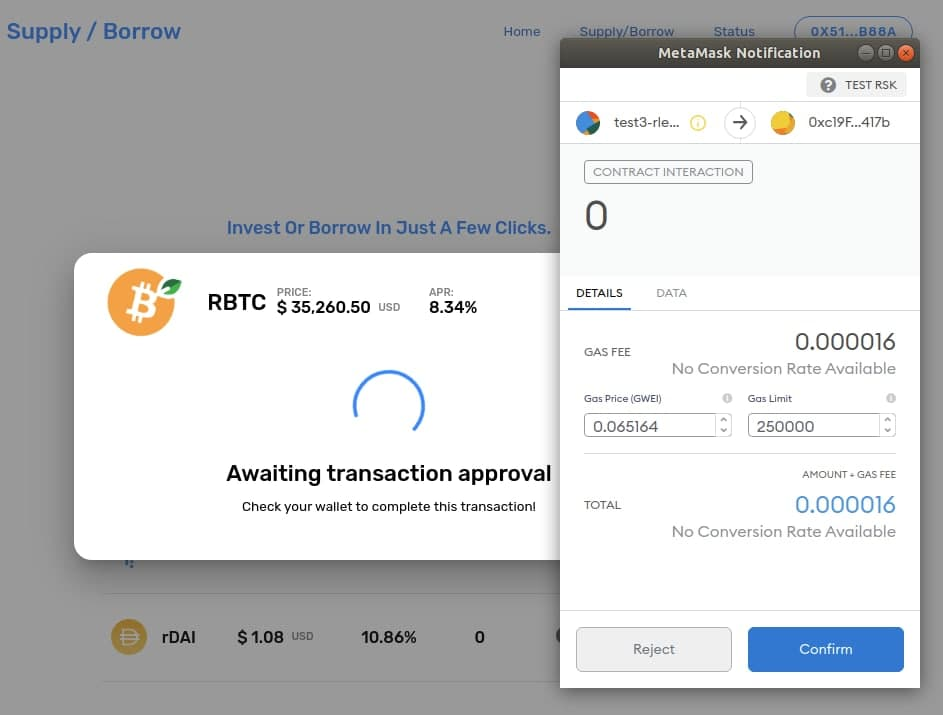

# How To

## How to connect to the platform:
In order to use **rLending** you will need your *Metamask* wallet connected to the **RSK network**
Direct your browser towards the [**rLending** website](www.rlending.com) and click **Connect Wallet**.
The screen will let you connect your *Metamask* wallet.

This will prompt you to choose your account within *Metamask*.
After you have accepted the connection, you will be redirected to the *Home Dashboard*.

In this screen you will have an overview of the status of your account (Totals supplied, borrowed, available liquidity and health factor)

---
## How to make a deposit:
**rLending** deposits are easy! After you have _connected your Metamask wallet_ you will be logged in and ready to supply funds.

When you are ready to make a deposit, you will have to click on the **Supply / Borrow** tab, where you will be able to see the current status of your supplied assets.

If this is the first time supplying, you might see a notice that lets you know how the toggle button works. We will go over it on the next section, in order to **Borrow assets**.

For now, click on the asset you wish to supply (in this example, we're supplying rBTC).

At the top of this screen you will find the asset's data, current price and the amount of this token you have supplied **converted to USD**.

Select the amount you wish to provide, and then click on **Supply Tokens**
This will promtp your *Metamask* for validation on the transaction.

After the transaction has been broadcasted you will recieve confirmation and your funds will be credited to your account.

In this last screen we double check the amount we have supplied in **Supply Balance**. We can also see the current liquidity the contract is holding in **Supplied to contract**. The **Borrow Limit** will not show unless the account has provided collateral. We will do this in the next section.

When a user supplies balance they immediately start earning interests, so **Congratulations! You are already earning interests!!**

---
## How to make a borrow:

All right, when a user supplies balance they immediately start earning interests... but where do those interests come from? Short answer: _Borrowers_! Those accounts that borrow crypto assets from the **rLending** protocol pay a varying interest rate every rBTC block. The interest that borrowers pay produces the interest that suppliers earn.

Before you can borrow you need to collateralize your account!  An asset that is supplied to the protocol is not usable as collateral initially. In order to inform the protocol that you wish to use an asset as collateral, you must “enter the market” for that asset.

**Toggle the Collateral column to enter your supplied funds as collateral**

This will promtp you for confirmation. If you confirm, this will then prompt your *Metamask* for confirmation, since this is a transaction that requires GAS.

If successful, you will receive confirmation and the borrowing warning will dissapear from the background.

An account can enter multiple markets at one time. You can do this by toggling each one you would like to operate with.
**It is important to notice that in order to borrow from a market, you also need to enter that market, even if your account hasn't supplied balance to that market.**

In this example we will be borrowing **RIF**

---
# How to make a withdrawal:
If at some point you decide you want to withdraw your funds, you should know you will be reedming your cToken balance in exchange for their respective underlying assets. Withdrawals are accessed through the Supply menu, in the Supply/Borrow page.

First, log in. Then go to the Supply/Borrow market list.

There you will need to select the market that you wish to withdraw from.

After you've chosen the amount you with to withdraw, click _Withdraw my tokens_ and _Metamask_ will prompt you with the transaction.

After the withdrawal has been broadcasted you will recieve confirmation and your funds will be credited to your account.

_Note that big withdrawals may considerably reduce your health factor!!_

---
# How to repay debt:
Borrows can be repaid using a function on the respective cToken contract. Once a borrow has been repaid, the account’s collateral can be entirely redeemed or transferred. There are also functions in the cToken contracts to repay a borrow on behalf of another account.

---
# How to liquidate underwater accounts:
A borrowing account becomes insolvent when the Borrow Balance exceeds the amount allowed by the collateral factor. When an account becomes insolvent, other users can repay a portion of its outstanding borrow in exchange for a portion of its collateral, with a liquidation incentive — currently set at 8\% but subject to change through **rLending**’s governance system. The liquidation incentive means that liquidators receive the borrower’s collateral at a 8\% discount to market price. Having your account liquidated is bad because you lose some of your collateral.

A user who has negative account liquidity is subject to liquidation by other users of the protocol to return his/her account liquidity back to positive (i.e. above the collateral requirement). When a liquidation occurs, a liquidator may repay some or all of an outstanding borrow on behalf of a borrower and in return receive a discounted amount of collateral held by the borrower; this discount is defined as the liquidation incentive.

A liquidator may close up to a certain fixed percentage (i.e. close factor) of any individual outstanding borrow of the underwater account. Unlike in v1, liquidators must interact with each cToken contract in which they wish to repay a borrow and seize another asset as collateral. When collateral is seized, the liquidator is transferred cTokens, which they may redeem the same as if they had supplied the asset themselves. Users must approve each cToken contract before calling liquidate (i.e. on the borrowed asset which they are repaying), as they are transferring funds into the contract.

---
# How to interpret market data:
\textbf{rLending} markets!
The **rLending** Protocol enables developers to build innovative products on DeFi. So far, we’ve seen crypto wallets equipped with savings APRs, a no-loss lottery system, an interest-earning system for donation income, and more.
The smart contracts that power the protocol are deployed to the Ethereum blockchain. This means that at the time of this guide’s writing, the only types of assets that **rLending** can support are Ether and ERC-20 tokens.
The currently supported assets are listed here (rlending market)[www.rlending.com]. Based on the different implementation of Ether (ETH) and ERC-20 tokens, we have to utilize two similar processes:
The ETH supply method
The ERC20 token supply method
Like mentioned earlier, when someone supplies an asset to the protocol, they are given cTokens in exchange. The method for getting cETH is different from the method for getting cDAI, cUNI, or any other cToken for an ERC-20 asset. We’ll run through code examples and explanations for the two different asset supply methods.
When supplying Ether to the **rLending** protocol, an application can send ETH directly to the payable mint function in the cEther contract. Following that mint, cEther is minted for the wallet or contract that invoked the mint function. Remember that if you are calling this function from another smart contract, that contract needs a payable function in order to receive ETH when you redeem the cTokens later.
The operation is slightly different for cERC20 tokens. In order to mint cERC20 tokens, the invoking wallet or contract needs to first call the approve function on the underlying token’s contract. All ERC20 token contracts have an approve function.
The approval needs to indicate that the corresponding cToken contract is permitted to take up to the specified amount from the sender address. Subsequently, when the mint function is invoked, the cToken contract retrieves the indicated amount of underlying tokens from the sender address, based on the prior approve call.
